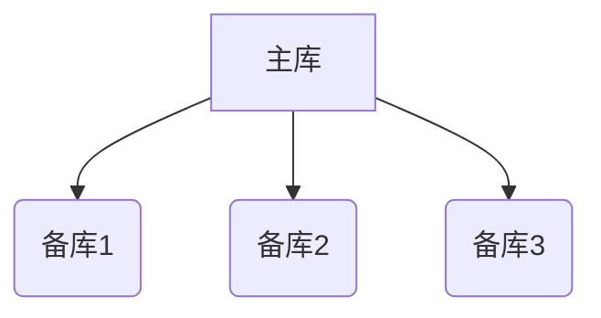
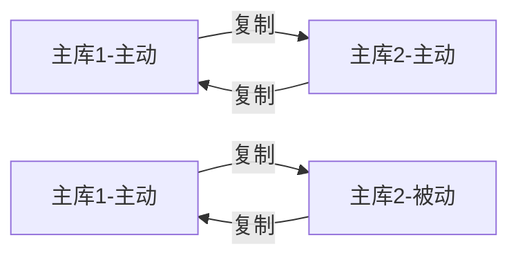
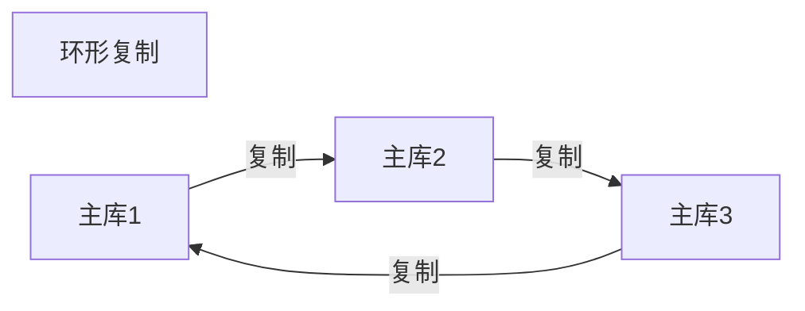
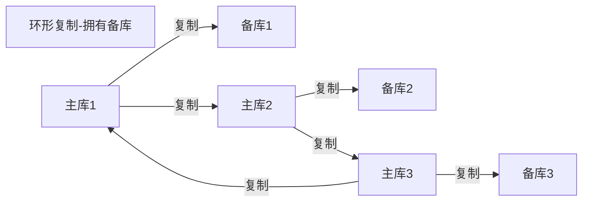
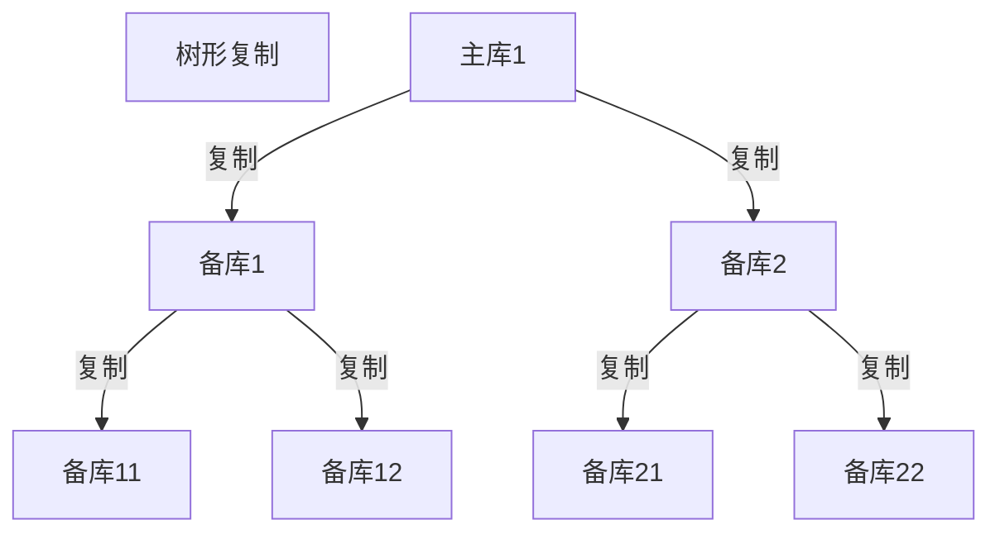

* content
{:toc}


### 简单说明

**MySQL的复制，主要的用途：数据分布，负载均衡，备份，高性能可用与故障切换。**

关于复制：可以基于行复制和基于语句复制。【语句复制有操作语句限制的】

方式：都是通过主库上记录二进制日志，然后在备库重放日志的方式来完成的。【不保证同一时间主备数据一致】

### 复制原理

三个步骤：

* 主库上吧数据的更改记录到二进制日志（BinLog）中，；【关于BinLog等的配置，后续细说】
* 备库把主库的日志，复制到自己的中继日志（Relay Log）中.
* 备库读取中继日志的时间，重放到备库的数据上。【相当于重做一遍的意思】

> 注意一下，由于主库BinLog到备库RelayLog中，属于串行化的了。备库的重做也就只能单线程处理了╮(╯_╰)╭
>
> <font color=yellow>然而，新的版本已经有了多线程复制的了  这书呀的版本太旧了</font>  

### 具体的配置

> 配置均为调整my.cnf 配置文件！
>
> 查看状态：`show master status;`和`show slave status` ；

#### 主库配置

```mysql
log_bin=mysql-bin
server_id=10    # 这个为必填配置，唯一的服务ID
```

主库可以创建备份使用的独立账户：

```mysql 
GRANT REPLICATION SLAVE,RELOAD,SUPER ON *.* TO backup@’192.168.1.102’ IDENTIFIED BY ‘123456’;
FLUSH PRIVILEGES;  生效创建的用户
建立一个帐户backup，并且只能允许从192.168.1.102这个地址上来登陆，密码是123456。
```

#### 备库的配置

```mysql
log_bin=mysql-bin
server_id=2    # 这个为必填配置，唯一的服务ID
relay_log=/var/lib/mysql/mysql-relay-bin    # 非必配置
log_slave_updates=1  # 表示是否将重放事件记录到自身的二进制日志中
read_only=1 # 配置为只读
```


#### 其他的Binlog配置

```mysql
# 以下为配置介绍，非最优配置！！！  查看状态：show variables like 'log_%'; 
#设置日志格式 MIXED：混合模式；STATEMENT：逻辑模式【默认】；ROW：行模式【建议使用】；
binlog_format = mixed
#设置日志路径，注意路经需要mysql用户有权限写
log-bin = /data/mysql/logs/mysql-bin.log
#设置binlog清理时间
expire_logs_days = 7
#binlog每个日志文件大小
max_binlog_size = 100m
#binlog缓存大小
binlog_cache_size = 4m
#最大binlog缓存大小
max_binlog_cache_size = 512m
```


###  启动主备复制

```mysql 
mysql> CHANGE MASTER TO MASTER_HOST='mastrt服务器地址',
    -> MASTER_USER='master服务器用户，使用刚才创建的backup',
    -> MASTER_PASSWORD='密码',
    -> MASTER_LOG_FILE='master的show master status的file，实际填写mysql-bin.000009',
	-> MASTER_LOG_POS=0;   master的show master status的Position

使用 SHOW SLAVE STATUS\G语句查看slave的设置是否正确

mysql> START SLAVE;

可以使用 SHOW PROCESSLIST 来查看主备库的线程。
```

> 至此，简单的主备复制就可了，主备都是新数据库的情况。应该就酱紫了 o(*￣︶￣*)o   

---

### 业务情景下的主备复制

> 业务场景下，在进行创建备库的时候，主库不可能是已经新的数据库，而是已经有大量的数据的了。这个情况下再进行，备库的搭建，是为最常见项目场景的了。

**需要的三个关键信息：**

*  某一个时间点的主库的数据快照。
* 主库当前的二进制日志文件，以及获得数据快照时在该二进制日志文件中的偏移量。【使用 show master status 进行获取】
* 从快照时间到当前现在的二进制日志。

**可行的方法：**

* 使用冷备份：需要停机复制主库，不推荐。
* 使用mysqldump转储主库的数据并加载到备库。【仅支持InnoDB】
* 使用快照或备份进行创建。【推荐】
* 使用Percona Xtrabackup 工具进行热备份。推荐】

> 具体的方法，并不在同一章节，在之后的专门的备份恢复章节。

---

### 主备的拓扑结构

> 一些情况下，数据库的拓扑结构不仅仅只是两台的主备数据库，而是一主多备，双主，环形树形复制等。

#### 基本的原则

* 一个MySQL备库实例只能有一个主库。 【MySQL 不支持多主库的复制】
* 备库必须有唯一的服务器ID
* 一个主库可以有多个备库。
* 如果打开了备库的log_slave_updates选项，备库可以作为主库再传播数据到其他备库。

#### 常见的各种拓扑结构

##### 一主库多备库



 主要用于少量写大量读的情景，远程备份防灾。

##### 双主复制



双主复制中，双主动复制的情况，会出现很多的问题，因为两个库存在同时写入相同行数据的情况，会造成数据冲突等等。

而，一主动 一被动的双主复制，设置被动主库为只读的情况。用于在故障的时候方便切换数据库。

##### 奇奇怪怪的结构







作用的话：

* 作为数据归档
* 备库作为全文检索进行查询
* 作为只读备库，分流查询压力
* 作为数据分析使用
* 差不多就这些理由了 ╮(╯_╰)╭

---

### 一些重要的问题[重点]

> 这一些才是重要的东西，书里面研究的版本已经比较旧了【最多到5.5】。对于新的一些特性与优化，需要去查一下了。【目前使用的版本是5.7的，虽然官方有8的版本了。】
>
> ε=(´ο｀*)))唉  感觉越学，要学习的东西就变得更多了 。╮(╯_╰)╭ 。。。

####  InnoDB加锁读引起的锁征用

正常InnoDB的读操作都是非阻塞的，但是在 `insert。。。select。。。`这个操作的时候会锁定源表上的所有行。

以避免操作在主备库上的不一致╮(╯_╰)╭  ？？ 加锁，使主库的语句串行化，以保证主备执行一致。

> select 的表示InnoDB类型的情况，会对select的表的记录进行锁定。
>
> 可以使用游标循环插入避免此锁定问题

---

#### 关于半同步复制

>  从MySQL5.5开始，MySQL以插件的形式支持半同步复制。 【495】

* 异步复制（Asynchronous replication）【默认】
  * MySQL默认的复制即是异步的，主库在执行完客户端提交的事务后会立即将结果返给给客户端，并不关心从库是否已经接收并处理，这样就会有一个问题，主如果crash掉了，此时主上已经提交的事务可能并没有传到从上，如果此时，强行将从提升为主，可能导致新主上的数据不完整。
* 全同步复制（Fully synchronous replication）
  * 指当主库执行完一个事务，所有的从库都执行了该事务才返回给客户端。因为需要等待所有从库执行完该事务才能返回，所以全同步复制的性能必然会收到严重的影响。
* 半同步复制（Semisynchronous replication）
  * 介于异步复制和全同步复制之间，主库在执行完客户端提交的事务后不是立刻返回给客户端，而是等待至少一个从库接收到并写到relay log中才返回给客户端。相对于异步复制，半同步复制提高了数据的安全性，同时它也造成了一定程度的延迟，这个延迟最少是一个TCP/IP往返的时间。所以，半同步复制最好在低延时的网络中使用。

**关于半同步复制存在的数据丢失的潜在问题，MySQL 5.7引入了一种新的半同步方案：Loss-Less半同步复制。**

> MySQL 5.7.2引入了一个新的参数进行控制-rpl_semi_sync_master_wait_point
>
> AFTER_SYNC：这个即新的半同步方案，Waiting Slave dump在Storage Commit之前。
>
> AFTER_COMMIT：老的半同步方案

要想使用半同步复制，必须满足以下几个条件：

1. MySQL 5.5及以上版本
2. 变量have_dynamic_loading为YES ：`show variables like '%have_dynamic_loading%'`
3. 异步复制已经存在

 然后使用半同步，是以组件的形式支持的。

组件名：rpl_semi_sync_master       

> 查看方式：【默认是没有这个组件的】
>
> mysql> show plugins;
>
> mysql> SELECT PLUGIN_NAME, PLUGIN_STATUS FROM INFORMATION_SCHEMA.PLUGINS  WHERE PLUGIN_NAME LIKE '%semi%';

具体的操作，请在需要使用的时候查看官方组件的文档，或其他的教学文档。这里略过了。

> 可以查看的参考文章：
> <https://www.cnblogs.com/ivictor/p/5735580.html>
> <https://www.actionsky.com/2486.html>
>
> 官方半同步复制组件文档：
> <https://dev.mysql.com/doc/refman/5.7/en/replication-semisync-installation.html>

---

#### 关于多线程复制-组复制

> 支持的话，在MySQL5.6的版本之后就支持了，5.7.2 进行了优化，增加了参数slave_parallel_type；

对于多线程复制的一些说明：

> MySQL5.5 及以前的复制：
>
> 一般主从复制有三个线程且都是单线程：
> Binlog Dump（主） ‐‐> IO Thread（从） ‐‐> SQL Thread（从）。
>
> 而master 这边是通过并发线程提交，事务通过LSN 写入binlog；但是Slave 只有一个IO 线程和SQL 线程，是单线程，所以在业务大的情况下就很容易造成主从延时.
>
> 如果在MySQL 5.6 版本开启并行复制功能（slave_parallel_workers > 0），那么SQL 线程就变为了coordinator 线程，coordinator 线程主要负责以下两部分内容：
>
> Coordinator+worker（多个）
>
> 问题在与这个时的并发是基于库的，但是通常情况用户止只有一个库，就无法进行并发了。
>
> 5.7.2版本之后的：slave_parallel_type，参数给处理优化：
>
> **slave‐parallel‐type，其可以配置的值有：**
>
> * DATABASE：默认值，基于库的并行复制方式
> * **LOGICAL_CLOCK：基于组提交的并行复制方式【需要的就是这个】**

以上是大概的说明了。

**关于多线程复制的具体点的配置操作：**

> 这里只是整理了一些资料而已，没有实际操作过**。如需要进行配置，请认真查看官方说明。**

首先，主库上，好像不需要什么操作的样子。

然后，从库上的操作：【查看线程` show processlist;`】

1. 停止同步状态：`stop slave;`
2. **设置并发同步类型为逻辑时钟方式:**
   1.  show variables like 'slave_parallel_type';
   2. set global slave_parallel_type='logical_clock';
3. **设置复制线程的数量:**
   1. show variables like 'slave_parallel_workers';
   2.  set global slave_parallel_workers=4; 
4. 还需要调整的配置:
   1. 设置 [`master_info_repository=TABLE`](https://dev.mysql.com/doc/refman/5.7/en/replication-options-slave.html#sysvar_master_info_repository) 和 [`relay_log_info_repository=TABLE`](https://dev.mysql.com/doc/refman/5.7/en/replication-options-slave.html#sysvar_relay_log_info_repository)。
   2. [`slave_preserve_commit_order=1`](https://dev.mysql.com/doc/refman/5.7/en/replication-options-slave.html#sysvar_slave_preserve_commit_order)
   3. 具体要求查看官方文档：<https://dev.mysql.com/doc/refman/5.7/en/group-replication-requirements.html>
5. 启动复制 :start slave;

参看文章：

> <https://www.jianshu.com/p/d97a5643d090>
> <https://blog.51cto.com/11899934/1832201>
> [mysql主从之多线程复制](https://www.cnblogs.com/zyxnhr/p/11154700.html)  【有完整推荐的配置文件信息，很详细的】
>
> **官方配置**：<https://dev.mysql.com/doc/refman/5.7/en/replication-options-slave.html>
> **官方要求文档**：<https://dev.mysql.com/doc/refman/5.7/en/group-replication-requirements.html

---

#### 其他的复制技术

* Percona XtraDB Cluster 的同步复制
* Continuent 的 Tungsten Replicator ；
  * java编写的开源的中间件复制产品
  * 提供：数据复制，自动数据分片，多线程复制等等；
  * 【496~497】

#### 最总要的工具

* Percona Toolkit
* PerconaXtraBackup

---

2020-05-07 小杭   

ε=(´ο｀*)))唉 这算是白看了啊！ 很多东西在5.7版本已经优化调整了啊。。。。。

---

