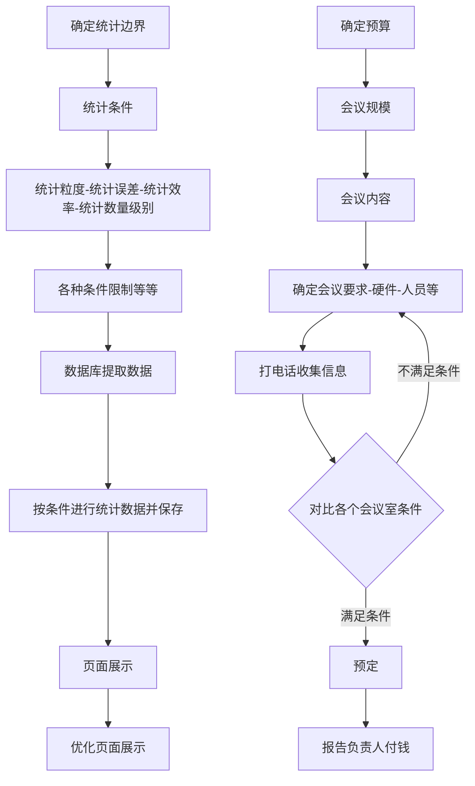

##  关于所谓能力和思维模型啥的

2020-03-17 路上 突然想到这些   ╮(╯_╰)╭ 还是记一下的好

> 所谓的能力，通常就是说工作能力吧，有的人可以很轻松胜任奇奇怪怪的事情，而有些人就灰常的辛苦，即便任务并不难。对于这种能力的分析，可以用一个定会议室的例子说明的样子。就是对工作流程的梳理，整合并模型化，参数化。
>
> 然后，能力表现之下则是每个人思维方式的不同，想到好的地方都提到了所谓的思维模型，思维升级啥的。可能就是，对各种思考方式，思考流程的梳理，整合，模型化的一种说法吧。
>
> 想好好整理下，自己认知的做事和思考的方式。【说不定会发现啥奇怪的东东 罒ω罒】

---

[TOC]

---

试试整理从基础能力，到能力提升的过程吧。

栗子就：职能：预定会议室；程序员：数据统计报表 【然后发现定会议室这种职能的能力，我并没有啊，整理不出来╮(╯_╰)╭ 职能瞎编了】 

---

### 基础能力

> 预定会议室：确定预算，会议规模，打电话，预定，报告负责人付钱
> 数据统计报表 ：数据库提取数据，保存统计数据，页面展示
> 【数据库提取数据，保持统计数据，页面展示。这个好像是提升一点了的】
>
> **这时候可以看做是各种的基础能力，比较的简单。无须做什么决策与思考。**

 ```mermaid
graph LR
    A0[数据库CURD] --> A1[数据库提取数据]
    A1 --> B(保存统计数据) 
    B --> B1(页面展示) 
    
    确定预算 --> 会议规模
    会议规模 --> 打电话了解信息
    打电话了解信息   --> 预定  
    预定 --> 报告负责人付钱
    
 ```

---

### 梳理流程 - 细化：

> 预定会议室：确定预算，会议规模，会议内容，会议要求，会议硬件要求，参会人员位置。。。打电话，对比各个会议室条件，判断满足条件的会议室，预定，报告负责人付钱
>
> 数据统计报表 ：确定统计边界，统计条件，统计粒度，统计误差，统计效率，统计数量级别。。。。数据库提取数据，保存统计数据，页面展示【如何方便查看数据等】

已经可以吧，**一件事情的始末之间，可能碰到的事情都进行的梳理。** **做事有理有条。**

> 这些个流程图，瞄一眼就可以了，并不是什么重点。




---

### 模块-流程化

以上的操作已经是可以满足日常的工作内容了，并且由于已经细化了各种的条件，已经可以做到比较好的结果了。

但是，我们的日常，并不是只有做一件事情的。**以上的一个操作，基本上只是一个超级大流程的一个模块。**

> 林大神那里了解到：关于思维模型和思维升级的事情
>
> **思维逻辑链作为开始，思维模型有很多，思维升级则是基于每个人的认识.**

然后觉得我的这个想法有点问题，我本来的想法是吧上面的，细化的具体能力流程进行参数化：

> 由于每个人的思维方式是不同的，所以在流程上的着重点也不一样，各种条件判断的权重也是完全不相同的。但这应该不影响，整个能力的模块化，不过结果应该有很大影响的吧？(ˇˍˇ) 想～
>
> **感觉我这明显是程序员的思考方式啊 w(ﾟДﾟ)w**
>
> * 预定会议室：
>   * 参数：预算，人数，硬件要求，人员 等
>   * 内容流程：收集会议室信息---**对比参数条件**---筛选最优会议室--预定
>   * 结果：预定会议室
>
> * 数据统计报表：
>   * 参数：统计内容，数据量，边界，频率，展示方式等
>   * 内容流程：**按照条件提取**数据-------处理统计数据-------保存统计数据--------页面展示
>   * 结果：页面展示统计报表

**就像这样。是不是觉得灰常的不对劲！！ 我也是这么觉得。**

**所以换了个流程化的*

### 【思维逻辑链？╮(╯_╰)╭】


**这个流程所表示的思维导图。这个框框表示的就是目前的整个细化的模块。与之相同大小的功能在流程中就有3个，画不出来了，太多了。**


然后作为一个人，的一个角色：程序员。**所要拥有的以上整个开发统计模块的能力块就有N个**。

而这，仅仅是一部分的。想想，作为一个人的角色不可能只有一个，所要做的技术能力也不止这么点。

辣么，如果都画出来，会像什么样子呢：


整个图就只是做个样子，表示一下的。**而且，这不可能是一个人所有的能力的描述的。都不一定到1%呢！！**

[使用的思维导图源文件](.\一个人.emmx)

像这样，能把**一个模块的能力整理到**对应的模块**能力的流程链中**，这个时候，人的思考方式就会变得更系统【更开阔？】。**此时做同一件事情，思考的就会更多全局上的事情了，细节已经在流程链的各个模块能力中各自细化了。**

---

#### 模块化与世界观的对比

> 博客：《世界观》的一些想法: <https://blog.csdn.net/xiaohangblog/article/details/104468503>  

此时，如果对世界观的概念有了解的话，很容易就会联想到，这个**能力的思维链，模块整合**。在量大的情况下，**与**我们个**人的世界观**是灰常的**相似**。


个人的世界观，与认知水平。是会影响到思维逻辑的，也会影响到上述模块流程化能力的。

> 栗子：
>
> * 认为只要结果对就系了--> 数据统计上就不会有优化的流程
> * 认为页面展示并不重要 --> 就不会进行页面细节优化的流程
> * 认为预定会议室的预算对比不是自己的工作 --> 就不会进行条件筛选，而直接向上汇报等待结果
> * 等等、、、、、、

**所以是不是可以认为：能力的细化与流程化，取决于个人的认知水平，因为这直接决定的细化与模块话的方向。**

**而对于一个人的能力树【能力网络】，主干分支越多表示能力越多元化，而子叶越深表示能力越细化。**

这个时候就会有一个问题： **个人发展到认知自己能力网络需要升级是需要如何做呢？？？**

---

###  提升问题

这个问题，我想的大概有3个方向：

* 细化，精通某一个能力
* 扩展，学习更多，各个方面的能力【并不精通】
* 升级认知水平【这个好像太难做到了╮(╯_╰)╭】

> 我一开始的时候的想法：
> 【这里并没有考虑到，思维升级这个方向。】
>
> **优化：【细化】**
>
> * 深入研究每一个流程的
>   * 问题：有时候研究太深的效率提升并不明显
>   * 问题：伤脑
> * 细化每一个过程，预算建议，会议要求细化，条件对比优先级权重权衡
>   * 问题：太细化的条件，并不适合所有人，可能会与他人观点冲突
>
> **规模化：【扩展】**
>
> * 类比整理跟多的模型。
>   * 问题：超级花时间思考
> * 外界学习获取各种的模型：【林炎发的华杉。七大思维模型】
>   * 问题：学习的模型不一定适合自己，还得整理不然可能会冲突
>   * 问题：浅显的了解，是没有什么用的

现在对这个的一些想法：

> 作为程序员，我觉得首先肯定是细化程序员的能力，并且一直往源码走，直至精通。
> 至于其他的能力：管理，招聘，教学等，属于扩展的了。

* **细化 个人核心能力**
  * 在**提升细化**核心能力的时候，会发现**也会有**超级多的**扩展内容**。
    * 栗子：程序员web方向细化：数据库，前端，架构，java本身等等
  * 这就要进行再次选择细化提升的方向了。【要知道，精力有限，不可能全部一起提升的】
  * 在对核心能力提升的时候，**会涉及更多的基础技能【通用技能】、其他模块的内容，以及会改变一些事物的认知**
    * 栗子：在java语言本身提升中，会慢慢进行源码阅读，这个可是高级通用技能的。
    * 栗子：前端的深入学习，在日常看网页等前端展示的时候，会默认拆解页面元素，进行代码化。
    * 栗子：对架构的深入理解，会慢慢考虑到公司业务的整体流程，架构等等。
* **扩展  乱七八糟的能力**
  * **对于完成一些复杂的项目，需要的能力是各个方面的。**
    * 栗子：负责管理后台项目：招聘，需求交流确认，人员任务安排，跨组协调，组内培训，技术选型等等
  * **对于这种扩展的能力，大多数是一些通用能力，而一些专业能力可能并不用的上**
    * 栗子：网络资源学习了销售技巧啥的，然后作为程序员你压根用不到。
    * 栗子：学习了招聘技巧，交流能力，业务流程等。这些是在各个地方都用的到的。
* **认知升级** 
  * **个人认为在核心能力的提升，与通用能力扩展上，就已经会在认知上进行升级了**
  * 书籍，网络资源等学习新的知识也是很好的提升方式，
    * 这里**需要完整的学习整个知识体系才行**
    * 只是，鸡汤一样看看概要啥的，并没什么用 ，因为无法根本上整合到自己已有的网络里面的
  * 对于各种的思维模型
    * 查理·芒格：分享12个顶级思维模型之类的
    * 个人觉得，并不是每个人都适用。并且与上一点一样，必须整个体系的学习。

以上这个是两个是大体的方向，应该也是大部分人学习的方式了。至于认证升级属于知识盲区，知道的太少了无法说明。

---

### 对各种思维模型等的看法

百度一下，思维模型，就会会有一堆堆的内容了。

*  [查理.芒格的100个*思维模型*具体是什么? - 知乎](https://www.baidu.com/link?url=ABClpZuFtq9QR9nuxozJ4QUJQgGpBq33jB0bmN2aXIiyQ-oZ1PyBxgyqEXIyl_wfBd5KIO8J1Cd8GRukETBKNa&wd=&eqid=e41df202000108ec000000065e7d9309)

*  [十六种顶级的*思维模型* - 格上财富](http://www.baidu.com/link?url=nT7mq1lQuoNJ4EQnwTkadQOoQqLcM3xt4PxsGsUxBMvyRdgK_PZLzwCkiqvtqA3QGrYfjlNGXuM1uTrPvZxpaRA7T841LfMBjjtqLz4OJgq)

。。。。。。。

这个世界上的思维模型，太多了。任何一个人吧自己的思考做事情的方式，整理一下就是思维模型了。

比如这些：

> 专注于当前的任务，控制支出
> 选择那些你愿意与他们做朋友的客户
> 一人专注资本运转，一人吸引客户
> 通过控股一家公司来建立财富
> 救人之前谈报酬
> 合伙人最好能够独立工作
> 能够给别人带来更多价值的工作
> 世间真正的伟人同时也必定是真正道德高尚之人
> 基本哲学观点：深刻而现实的对人本性的怀疑精神
> 在西塞罗的价值系统中，我将很有可能飞黄腾达
> 把工作做好的自豪感是非常有建设性的

**觉得觉最多算个建议，跟鸡汤一样的味道╮(╯_╰)╭**

真正需要的，则是具体的知识，能力，最好还是能用上的。
比如：

> 如何专注，如何控制支出
> 如何资本运作，如何吸引客户
> 等等。。。。。。。。
>
> **其他的一些说法甚至对你来说就是个笑话：**
>
> 一人专注资本运转，一人吸引客户
> 通过控股一家公司来建立财富
> 世间真正的伟人同时也必定是真正道德高尚之人
>
> 这些就不是个打工的人能遇到的情况，有个毛线用啊！！！

当知道了具体的技巧，能力的时候，要用上才行啊！不在生活中用的到的，就是空谈。

【阅读知识则是另外一种情况，小说，历史，传记 是用来增长见识的。知识的积累可能会潜移默化的改变认知的】

---

### 炎大神说的

> 炎大神研究的，果然。。。。。属于我的知识盲区啊  ╮(╯_╰)╭ 

* 炎大神说的：最小闭环 ？

  * MVP ？【过于高级，略过以后再研究】

  * > MVP之所以能成为最小闭环，一定是经过化繁为简的过程。繁，是在每个流程上穷举过无数种可能，要达到这个效果，又需要查阅大量信息，咨询大量专业人士。简，是经过分析每种可能的利弊，最后不断删减得出的结果。我们当然要考虑完成闭环所需的时间，只是比时间更重要的因素是，删减后的结果是你要的业务最小闭环吗？
    >
    > 只看皮相，不究内里，终会活成糊涂人。

* 炎大神说的：多元思维模型 ？

  * 这个好像更高级的东东啊  ？？？？？？？？？？？
  * <https://zhuanlan.zhihu.com/p/37160090> 
  * <https://www.zhihu.com/question/29365879> 

* 理论体系

  * 比如：现代综合进化论【世界观书里有提到】
  * 这些体系都是超多模型组成的吧 ？？？ 有关联的模型集合成体系？？？

> 炎大神说明：
> 昨天说的思维模型和思维升级的事情
> 我觉得应该从思维逻辑链开始
> 思维模型有很多，思维升级也是基于每个人认识不同决定的。
> 我的想法是要先认识升级，然后以认知为原点发展思维逻辑链，再把思维模式匹配，安在不同的逻辑链上。最后成果应该就是思维升级
> 而思维逻辑链上，不同的思维模型，匹配不同的能力

---

### 关于能力、思维模型、体系的个人观点

* 能力
  * 我开始说的那些，具体做事情的能力，流程，逻辑链，必要的技术知识。都属于能力
  * 后续的，思维逻辑链，模块化，流程，也是具体的能力
* 思维模型
  * 对于思维模型，我保持仅仅只是个建议看看的观点
* 体系
  * 炎大神说的：最小闭环MVP
  * 世界观中的：现代综合进化论
  * 想这样的属于体系，有这完整理论基础知识，与各种关联知识，观点等等
  * 这才是我认为应该学习的东西，
  * 是我觉得真正影响个人的思维模型构建

---

### 小结

这次花时间，认真整理了一下这些关于思维啥的想法。

果然我应该属于典型的**实用主义程序员**啊！！！哈哈哈哈哈。。。。。

倾向于，个人能力【技能】与 知识【认知】体系的发展，对所谓的观点形的思维模型并不认可。

最后，下次得花时间研究炎大神说的**最小闭环MVP**了【看了简介，有完整的理论与实践的知识，并且应该属于通用技能】，感觉是个好东东罒ω罒！！！！！！

---

2020-03-27 小杭 

---

### 与炎大神的对比

**炎大神的观点**

* 以认知升级为起点，引发对本身思维逻辑链的思考，进而引发后续的提升
* 炎大神由于做过的职位比较多【设计运营方向的】
  * **客服，运营，销售，设计，品牌推广，老板**
* **所以在完成一个项目的整体逻辑链之中，需要各个阶段使用不同职位的思维。**
  * 客服：思考客户交流等
  * 运营：推广宣传等
  * 设计：色彩，板式等
  * 品牌推广：推广政策，渠道推广，品牌定位等
  * 老板：管理资本，管理员工，管理项目立项
* 由于炎大神所工作的这个方向，有好多的角色分工配合，所以需要各种的思维逻辑。并且是用的上的，因为工作上就有这个多的分工。

**我的情况**

* 我就不一样了，**我就是个程序员**。也只会有一种**程序员的核心思维逻辑，一条路走到黑啊。。。。**
* 可以进行分工的【与大神各个职位对照的】：前端，设计【不参与】，后台，服务架构，运维。。
* 虽然有分工，但是这些的角色还是程序员啊！！！！！只是技术上的不同。。
* 及时我的核心方向以**全栈工程师**走，也就只能算是**整个项目逻辑链中的开发部分** **╮(╯_╰)╭**
* 如此的话，我上文内容中的扩展，依旧还只是在技术反向细化部分的扩展。并没有扩展到更为主干的分支。【最多已经通用技能的扩展】
* **看来还是没有跳出技术这个分支，以项目层面进行扩展思维逻辑啊 ε=(´ο｀*)))唉** 

**结论**

* 没法比啊！！！！技术路线与老板路线啊。。。。。
* **<font color=red  >虽然我觉得大神说的很在理，但是我做不到啊 ╮(╯_╰)╭</font>**
* 技术之外的扩展思维，我。。。。只能零散的来学习了。
* 【完整学习，并使用是不可能的】**毕竟不能和我的技术思维冲突了啊！！！！！！**

<font color=red size=5 face="黑体">哈哈哈 ，我对炎大神的观点保留意见</font>

---


